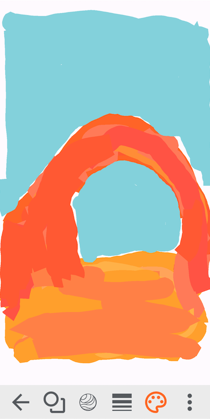
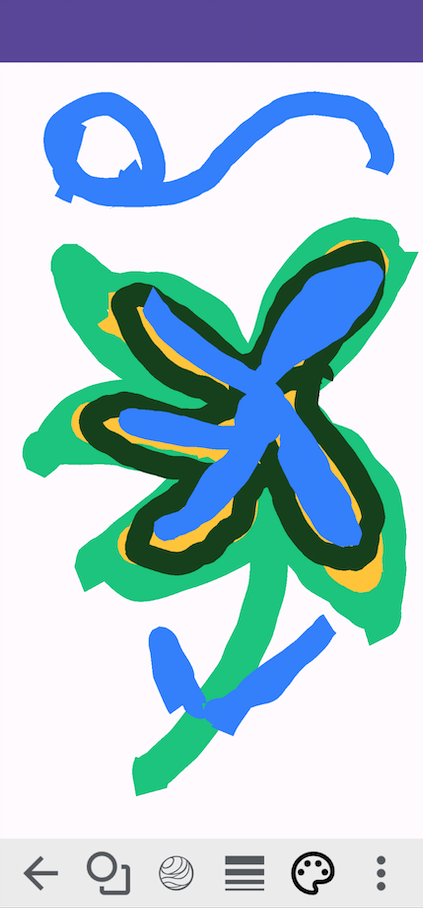
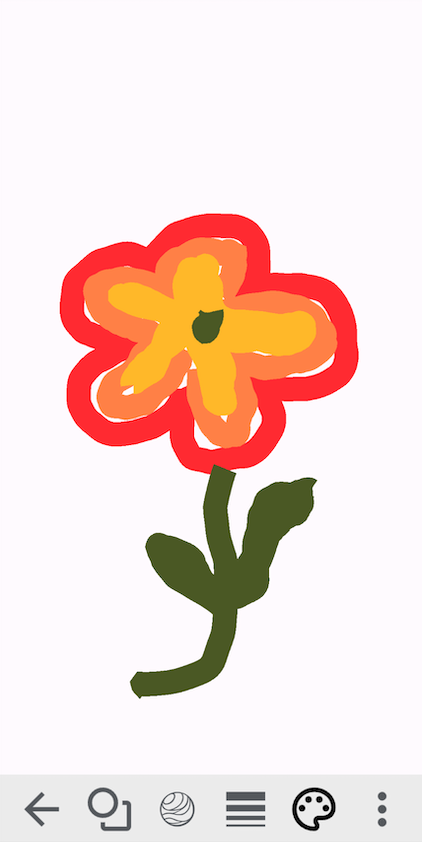
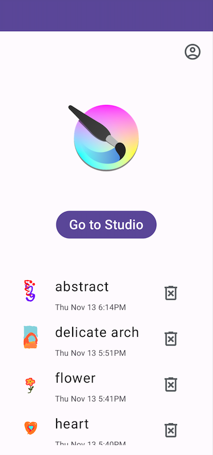
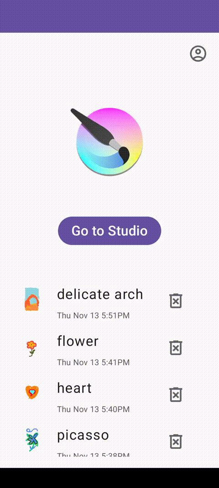

# msd-paint (Marble Paint)

    
    
    

    

    

## How to Use

1. Launch
2. Skip sign-in and/or user creation (see next section)
3. Tap "Go to Studio" to be taken to the canvas
4. Draw using different shapes, brush sizes, and colors
5. Use the eraser (top of brush size slider) to erase mistakes
6. Use the three-dot menu to access: 
   - Save (name it, and it will be saved to your device persistently)
   - Trash to start over
   - Share (not available right now -- see below)
7. You can shake the device to clear your canvas (erase all)
8. Press the marble button and use your phone to balance and draw with the marble
9. Save your creation
10. If you ever feel the desire to go back and edit a past doodle, just return to the main menu, select it, and begin your edits

## Things to Know

This project also had a server program which provided for the sharing, feed, user login, and cloud storage features via Firebase. But, since the server won't be ran, that functionality is unfortunately no longer available.

- However, the persistent file system storage is still available, so make sure you save your drawings. The save button can also be used as a Save As... button, so give drawings unique names unless you are in fact intending to overwrite a previous drawing.

This project was only tested on Google Pixel 5.

If attempting to build this project:

- Make sure you're on JDK 17-21. If you have a global java home on your $PATH that isn't one of those, make sure to point gradle at the right JDK, otherwise the build process will be very painful. If the gradle daemons _do_ cache the wrong JDK, export the correct one and run `./gradlew clean build` to clear out gradle's cache. It will pick up the new JDK this time.
- I have not decided whether to explicitly constrain this in gradle's build files yet

## Licenses

This project includes third-party dependencies licensed under Apache 2.0 and MIT. See [licenses](licenses) for full license texts.

- [Google Sign In Button Library](https://github.com/joyner-perez/GoogleSignInButtonLibrary) by [joyner-perez](https://github.com/joyner-perez)
- [Color Picker](https://github.com/QuadFlask/colorpicker) by [QuadFlask](https://github.com/QuadFlask)
